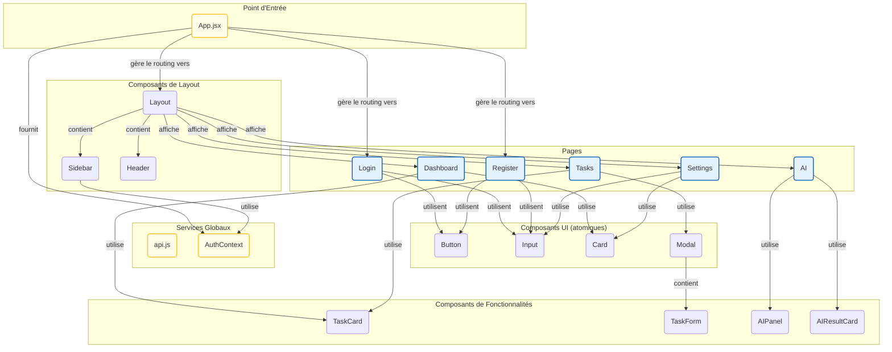

### Description

Ce diagramme de composants illustre l'architecture du frontend React :

-   **`App.jsx`** est le point d'entrée qui gère le routage et fournit le contexte d'authentification.
-   Les **Pages** (`Dashboard`, `Tasks`, etc.) sont les écrans principaux de l'application.
-   Le **Layout** et ses composants (`Sidebar`, `Header`) structurent l'interface des pages privées.
-   Les **Composants de Fonctionnalités** (`TaskCard`, `AIPanel`) encapsulent une logique métier spécifique.
-   Les **Composants UI** sont des éléments de base réutilisables qui assurent la cohérence visuelle.