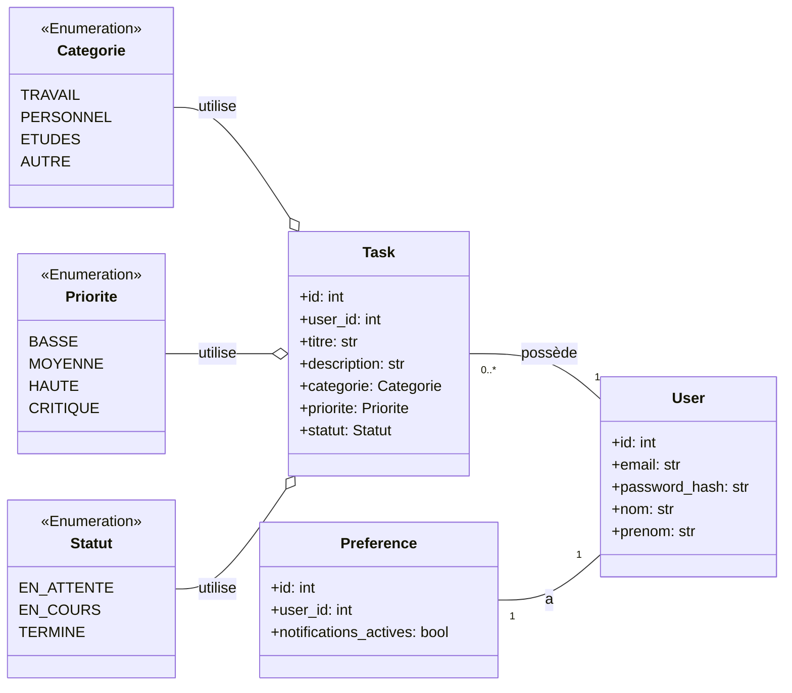

### Description

Ce diagramme de classes illustre les modèles de données principaux du backend et leurs relations :

-   Un `User` peut avoir `plusieurs` `Task` (relation un-à-plusieurs).
-   Chaque `User` a `une` `Preference` associée (relation un-à-un).
-   Chaque `Task` est associée à des énumérations (`Categorie`, `Priorite`, `Statut`) qui définissent des valeurs contraintes.